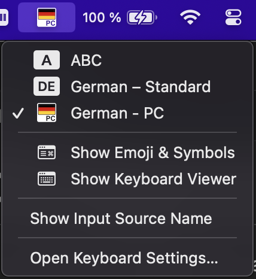

MacOS Keylayouts
================
I am using a German PC keyboard on a Mac and Apple's support for this is very bad. Here is a keyboard layout to fix this!

Meet the **German - PC** MacOS Keylayout.

Installation
------------

    make install

Or copy the `.keylayout` and the `.icns` files manually.

    cp *.keylayout *.icns "$HOME/Library/Keyboard Layouts"

Post Install
------------
To use the new keyboard layouts, you may need to log out and log back in.
You can select the keyboard layout in System Preferences > Keyboard > Input Sources. Or run `make settings` to jump there.

Development
-----------
See [Makefile](Makefile) for details how to develop layouts.
