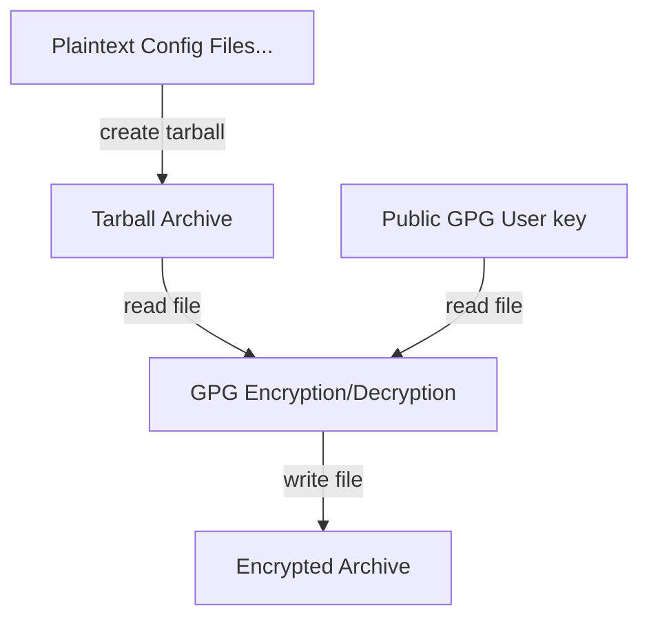
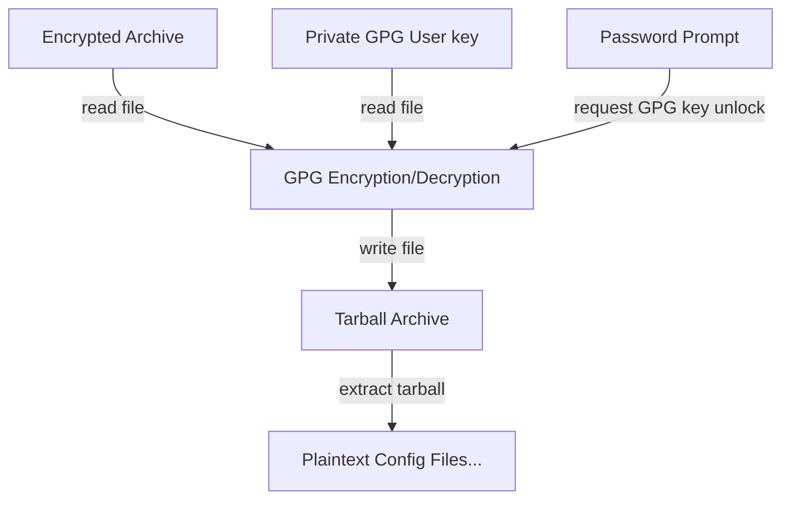

# Encrypted Homelab Configurations
This directory contains configuration files for my homelab setup.
This dir will typically contain sensitive information and should be kept private.

Use the script `crypt.sh` to encrypt and decrypt these files.

## Encrypt

## Decrypt

## Security Assessment
- The encryption uses GPG with asymmetric encryption, which is generally secure.
- Ensure that the private GPG key is kept secure and not shared.
- The script uses `tar` and `gzip` for archiving, which are standard tools.
- Backup the encrypted archive (`config.tar.gz.gpg`) to prevent data loss.
- Backup the GPG key pair and remember the passphrase for the private key to avoid being locked out of your data.
- Security horizon: 10 years, assuming strong passphrase and key management. After 10 years:
  - Rotate stored secrets.
  - Re-encrypt files with a new GPG key pair.
