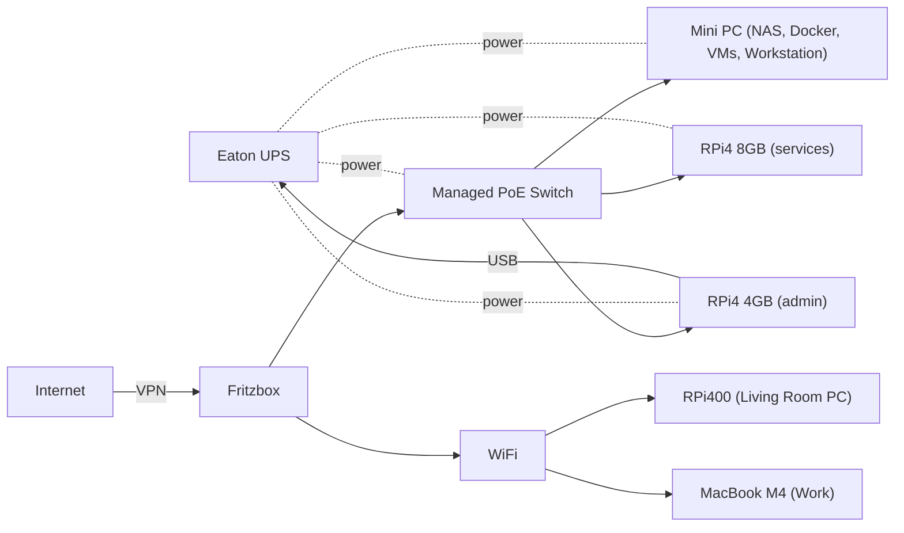

## Towards a real Homelab
This is a plan to move from a few manually managed devices to a more structured homelab setup with proper backup strategies. This is a living document and will be updated as needed.

> [!Note]
> AI Instructions: Please review this doc and create/update the new backup plan, according to the requirements.

### Current Situation
Running a few Raspberry Pis and a Mini PC at home for various tasks.
UPS connected to most devices. New managed PoE switch for better network management.
No services exposed to the internet directly, only via VPN (Wireguard).

### Backup Situation
Doing regular manual backups of my files for all my machines by copying complete home folders or at least key parts to `backup-<something>` dirs on external disks. No 3-2-1 strategy implemented yet.
Starting to lose track of what is where, what is current, what is old, etc.

## Existing Hardware
- Fritzbox (with functional Wireguard support + HA-enabled smart home features)
- Managed PoE Switch (VLAN support, supports all devices with GB Ethernet)
- Eaton UPS (with USB connectivity)
- RPi4 4GB + RPi4 8GB with a few services (mostly Docker based)
- RPi400 4GB (empty)
- Mini PC AMD 760m 32GB main private machine (1xM2 NVME, 1xM2 SATA, 1xM2 A/E-Key/Wifi)
  supports USB-C single cable mode support
- MacBook M4 work machine (512GB SSD)
- 1 TB 2.5" SSD "Fotos" disk (portable mini SSD, USB3/USB-C)
- 2 TB 2.5" HDD backup disk (Toshiba, USB3)
- 2 TB 3.5" HDD backup disk (Sammsung, 3.5" SATA bay, with 12V power supply)
- 4 TB 2.5" SSD main storage (WD Skyhawk, SATA)
- 2 TB 2.5" SSD main storage (Samsung, SATA)
- 1 TB M2 NVME SSD Windows OS (unused Mini PC OS)
- 256 GB M2 SDATA SSD (Mini PC OS)
- Bunch of older 2.5" SATA SSD (256GB, 128GB, 80GB, 64GB)
- Bunch of SD cards (128GB, 64GB, etc.)
- Bunch of USB sticks (64GB, 32GB, 16GB, 8GB)

## Extra Hardware
- M2 A/E Key to 2xSATA Adapter (not detected at boot in Mini PC)
- 12V barrel to 12/5V SATA power adapter
- 2x19V Powersupply (HP, Minisforum)
- 5-12V power supply
- Argon M2 Case for RPi4 (should be used ephemeral NVME disks only)
- GeeekPi 4xUSB Channel 5V PSU for (19", 1U, )

## Planned Hardware Usage
### Homelab Setup
- RPi4 1 4GB with critical services (PiHole at first)
- RPi4 2 8GB with anyhting else (Grafana, Prometheus, non-demanding tools)
- Mini PC as main home server:
  - NAS with as many disks as possible
  - deduplication support (or at least some tooling to clean up duplicates)
  - main host for Docker containers
  - maybe VMs (if they can run efficiently)
  - 24/7 online
  - connected to Display (HDMI) + KVM (USB)
  - used as main workstation for occasional work
- all devices connected to UPS
- all devices connected to managed switch (VLANs, PoE possible)

### Other Machines
- RPi400 Living room PC for lightweight web browsing (backup needed)
- MacBook M4 for work (backup needed)

### Required Services
- File sharing (SMB, NFS): All files should be managed as plain files, no databases
- Backups: 3-2-1 backup strategy:
  - 3 copies of any important file (1 primary, 2 backups)
  - 2 different media types (internal disk + external disk)
  - 1 offsite backup (cloud: current plan 2TB Google Drive)
  - combination of mergerfs + snapraid to keep all files as plain files
- Immich: self-hosted photo management
  - read-only file access to main photo storage
  - read-write access to dedicated photo collection
  - export dedicated photos out of immich to main storage occasionally
- Media server: Jellyfin
- Home Assistant: smart home management
- PiHole: ad-blocking + DNS
- Monitoring: Grafana + Prometheus
- VPN: Wireguard server for remote access to home network (provided by Fritzbox)
- SSH: secure remote access to all devices
- Web Admin: web-based management of all machines and services (Cockpit, etc.)
- Password Manager: Keepass DB file share or Vaultwarden
- CI Server: lightweight CI server for personal projects
- LLM Server: local LLM server for personal use (e.g. private GPT instance)
- Minecraft Hosting: MC server management for friends and family

## Network Diagram

## Operating Systems
- RPi4: Raspberry Pi OS Lite (64-bit)
- Mini PC: Ubuntu LTS (64-bit)
- RPi400: Raspberry Pi OS (64-bit)
- MacBook: MacOS (managed by work)

## Backup Strategy
See [Homelab Storage and Backup Strategy](Storage.md) for details.

## Infrastructure as Code
In the future, all devices and services could be managed via IaC tools.
For now, manual setup is sufficient.

## Roadmap
See [Homelab Roadmap](Roadmap.md) for details.