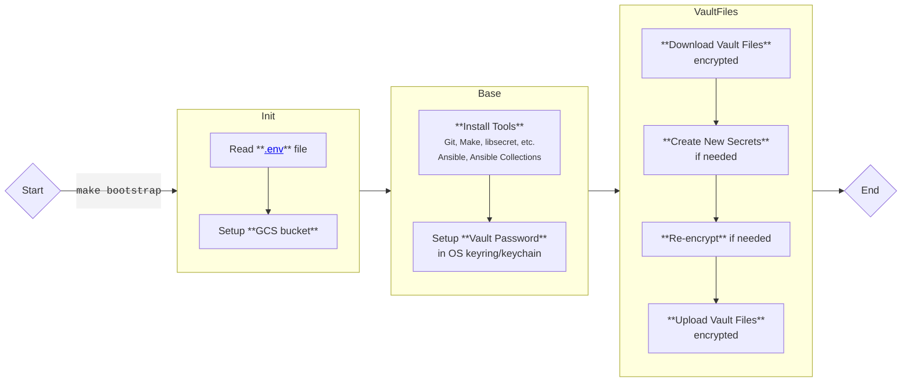

# Bootstrap Setup

Bootstrapping is the process of setting up a new developer machine to be able to work with the homelab infrastructure. This includes installing necessary tools, configuring Ansible, and setting up secure storage for secrets.

## Requirements
- I can develop playbooks, apps, and scripts on MacOS + Linux (Windows can be ignored)
- Main scripts and make target can be run on both systems
- Only minimal "if OS is XYZ" logic is needed
- Use OS-native package managers (brew, apt)
- Use OS-native secret storage (keyring, libsecret)
- Manage all secrets from the control machine and then deploy them to target machines. Target machines do not need to have the power to manage secrets
- Use Ansible Vault for encryption and decryption of secrets
- All playbooks and roles managing secrets should use predefined vault files and not create or manage them
- All secrets are stored encrypted outside of git, in a secure Google Cloud Storage bucket, which can only be accessed from the control machine.

## Master Vault Passwords
In the control machine, only master vault passwords are used to manage all other secrets.

  1. a "current" vault password is used to encrypt and decrypt all secrets
  2. a "previous" vault password is used to as fallback to decrypt secrets that have not yet been re-encrypted with the current password

Encryption and decryption flows must support both passwords to allow for smooth password rotation. The bootstrapping process must be idempotent and can be re-run at any time.

## What needs to be bootstrapped?
- Ansible
- Git, Make, libsecret, etc.
- Ansible Collections
- Ansible Vault Password Storage (setup password in OS keyring or libsecret)
- Vault files (downloaded from GCS bucket and decrypted on-demand with Ansible Vault)

## Implementation
See [bootstrap.mk](./bootstrap.mk) for the implementation of the make targets. \
See [Vault](./.vault/Vault.md) documentation for more information on how manage vault files.

### OS Switching
- Basic target switching is done via the `HOMELAB_DEVELOPER_OS` environment variable.
  This must be set in the `.env` file. It can be either `mac` or `linux`.
- The `.env` file is a manually managed file that is NOT checked into git.
  It contains non-sensitive configuration variables, incl. developer machine details.
- The Makefile uses `brew` on MacOS and `apt` on Linux to install packages.
- Make targets are named `bootstrap-ansible-mac` and `bootstrap-ansible-linux`,
  which can be referenced as `bootstrap-ansible-$(HOMELAB_DEVELOPER_OS)`.

## Bootstrap Instructions
To set up the necessary vault files on your machine, follow these steps:
1. Ensure you have `gcloud` and `gsutil` CLI tool installed on your machine
2. Ensure your Terminal session is authenticated with a Google account
3. Ensure this Google account has access to a Google Cloud Storage bucket where the vault files are stored.
4. Ensure you have an Ansible Vault password ready to encrypt and decrypt credentials files.
5. Run the following commands from the `homelab` directory:
   ```
   make .env
   ```
   This will create a `.env` file based on the [.env.example](../.env.example) file.
   Edit the `.env` file, setting the Google Cloud variables and your OS type.
   Start the bootstrap process:
   ```
   make bootstrap
   ```
   This will install necessary tools, set up Ansible, configure the vault password, and download the vault files as detailed below.

### Bootstrap Process


### Password Security
- The master vault passwords are never stored in plaintext on disk.
- The passwords are stored in the OS-native secret storage (MacOS Keychain, Linux libsecret).
- If you lose the master vault passwords, you will not be able to decrypt any secrets.
  - As fallback, you may be able to recover some secrets from target machines.
