# Security and Secret Management

This document outlines the security measures and secret management strategies for my homelab environment. It is crucial to ensure that sensitive information is protected and that access to systems is controlled.

## Initial Setup

## Secret Management Overview

The following table defines how secrets are created, stored, backed up, and accessed.
If possible, secrets should be stored in a dedicated password manager (e.g., Vaultwarden)
and accessed through its application or browser extension.

### Password Managers

- Vaultwarden (self-hosted Bitwarden instance) + companion apps/extensions. Requires a strong master password and 2FA. Runs as a Docker container. Apps/extensions available for all major platforms.
- Gnome Keyring (for Linux desktop environments). Integrated with the OS, can store passwords and keys securely. Can be used for passwords, SSH keys, and more.
- KeePassXC (local database). Open-source, cross-platform password manager. Stores passwords in an encrypted database file. Can be used for passwords, SSH keys, and more.

### Backup Strategies
- Regularly back up the password manager database to an encrypted external drive or cloud storage.
- Use versioning to keep track of changes and recover previous versions if needed.
- Automate import/export/backup using scripts or built-in features of the password manager.

### Secret Lifecycle
The following flowchart illustrates the lifecycle of secrets in the homelab environment using Vaultwarden + Gnome Keyring and Google Drive as backup storage.

```mermaid
flowchart TD
    User[User 🧑‍💻]

    O[OS Keychain 🔑]
    V[Vaultwarden]

    subgraph Clients[OS-based Clients 🖥️]
        Cli[CLI Tool 💻️]
        OS[OS Integration 🖥️]
    end

    subgraph Comp[Companion Apps]
        CompExt[Browser Extension 🌐]
        CompApp[Companion App 📱/💻️]
    end

    D[Google Drive ☁️]

    User -->|Access/Manage Secret| Clients & Comp

    Clients -->|Store/Retrieve| O
    Comp -->|Store/Retrieve| V

    V <-->|"Sync (encrypted)"| D
    V -->|"
        Backup
        (encrypted, versioned)
    "| D
    V <-->|Sync| O
```

| Secret Type | Creation Method | Security Model |
|-------------|-----------------|----------------|
| Passwords | Password Manager (e.g., Vaultwarden) | Strong master password, 2FA |
| SSH/GPG Keys | `ssh`/`gpg` cli tools | Strong passphrases, secure storage |
| API Keys | Generated via service provider's dashboard | Limited permissions, regular rotation |
| Certificates | Generated via Let's Encrypt or self-signed | Strong encryption, regular renewal |
| Configuration Files | Version control (`git`) | Encrypted at rest, access controls |
| Database Credentials | Password Manager | Strong passwords, 2FA |
| Cloud/Container Service Credentials | Password Manager | Strong passwords, 2FA |
| VPN Credentials | Password Manager | Strong passwords, 2FA |
| Application Secrets | Environment variables, Password Manager | Encrypted storage, access controls |

## Overall Guidelines ✨

> [!Note] AI-crafted content, not all things may apply to your situation. Always review and adapt to your specific needs.

The following guidelines should be followed to maintain a secure environment:

### Access Control

Implement strict access control measures to limit who can access sensitive information and systems. This includes:

- Using strong, unique passwords for all accounts.
- Enabling two-factor authentication (2FA) wherever possible.
- Regularly reviewing and updating access permissions.

### Secret Management

Properly manage secrets (e.g., API keys, passwords) to prevent unauthorized access. This includes:

- Using a dedicated secrets management tool (e.g., HashiCorp Vault, AWS Secrets Manager).
- Storing secrets in environment variables instead of hardcoding them in source code.
- Regularly rotating secrets and auditing access logs.

### Network Security

Protect the network infrastructure to prevent unauthorized access and attacks. This includes:

- Using firewalls to restrict incoming and outgoing traffic.
- Segmenting the network to limit the spread of potential breaches.
- Regularly updating and patching all software and devices.

### Incident Response

Have a plan in place for responding to security incidents. This includes:

- Regularly backing up data and configurations.
- Monitoring systems for suspicious activity.
- Conducting post-incident reviews to identify and address vulnerabilities.

By following these security measures and secret management strategies, I can help protect my homelab environment from potential threats.