# Homelab Storage and Backup Strategy

This doc covers only the Mini PC based storage solution. See [Homelab.md](./Homelab.md) for overall architecture.

## Power and Connectivity
### Mini PC:
  - 1x M.2 SATA, 1x NVMe, 1x NVMe (A/E Key with NVMe adapter)
  - 1x USB-C (with PD-in, not PD-out)
  - 2xUSB 2.0 (rear)
  - 2xUSB 3.0 (front, can go back with short angled cable)

### Storage Docks/Adapters
- SATA bay for 3.5" drives
  - spec: 12V 2A
  - disk rated 12V 0.5A + 5V 0.85A
  - min 12V 1.5A PSU recommended
- 2x USB to SATA adapters for 2.5" drives (powered via USB)
- 1x USB to SATA case for 2.5" drive (powered via USB)

### Power Supplies
- 19V PSU for Mini PC
- 12V 3A PSU (common small PSU case size, bigger than mobile chargers)
- 12V 1.66A USB-PD (mobile charger style)
- USB-PD trigger (5V/9V/12V/15V/20V, set to 12V)
- 5V 3A mobile charger for powered USB hub
- 5V 2.5A mobile charger for powered RPi4 USB hub
- more 5V USB mobile chargers for RPi4s and more

## Layout Approach
- Mini PC as main system with many M.2 drives
  - attach SATA bay for larger 3.5" drives (cold storage, powered separately)
  - attach powered USB hub for 2.5" drives (hot storage, powered separately)
  - attach KVM switch for monitor/keyboard/mouse
  - Use MergerFS to pool all drives into a single filesystem
  - Use SnapRAID for redundancy and data integrity
- Expected Number of Drives:
  - Mini PC: 3x M.2 (256GB SATA + 1TB NVMe + 2TB NVMe)
  - SATA Bay: 1x 3.5" (2TB HDD)
  - USB Hub: 2x 2.5" (4TB SSD + 2TB SDD)
  - Total: 6 drives, ~9.25TB raw capacity, ~8TB usable with SnapRAID

## Mini PC Storage Layout

```mermaid
graph LR
    subgraph Mini[Mini PC]
        USBC[USB-C, PD-in]
        subgraph M2[M.2 Slots]
          256G[256GB SSD] -.- M2SATA[M2 SATA]
          NVMe1TB[NVMe 2280 1TB] -.- NVMe1[M2 NVMe]
          NVMe2TB[NVMe 2230 2TB] -.- NVMe2 -.- M2AE[M2 A/E Key]
        end
        USB2.1[USB 2.0]
        USB2.2[USB 2.0]
        USB3.1[USB 3.0]
        USB3.2[USB 3.0]
    end

    subgraph SATABay[3.5 SATA Bay]
        HDD2S[2TB Samsung HDD]
    end

    subgraph USBHub["USB Hub (powered)"]
        subgraph SATABay[3.5 SATA Bay]
            HDD2S[2TB Samsung HDD]
        end
        SSD4[4TB Sandisk 3D]
        SSD2[2TB Samsung SSD]
    end

    subgraph Power[Power Supplies]
        subgraph USBPD
        direction TB
        USBPD65W[USB PD 65W 2C 2A]
        USBPD20W[USB PD 20W 1C <strike>1A</strike>] --> PSU12V.2[12V PD Trigger]
        end
        PSU19V[19V PSU]
        PSU12V.1[12V PSU]
        USB5V[5V3A PSU]
    end

    USBPD65W --o|⚡️| other[Other Devices]

    KVM --> USB3.2
    USBHub --> USB3.1

    USB5V --o|⚡️| USBHub
    PSU19V --o|⚡️| Mini
    PSU12V.2 --o|⚡️| SATABay
```


## Power Supply Considerations
- How much power do the 2x12V + 19V PSUs consume when all disks are active?
- Do I need all disks connected all the time?
- Does this setup make sense at all?
- Can a single 12V PSU power all SATA drives? How to safely split the power?
  Update: M2 A/E Key to 2xSATA adapter not detected at boot, focussing on USB drives for now.
- 19V vs. USB-PD for Mini PC. What is more efficient/reliable?
- USB-PD works fine for Mini PC (idle at 3W) and no issues so far, but blocks USB-C port.
- Can I use the USB-C port for connecting all USB devices?
  - Is there a good USB-C hub with PD-in + pass-through and multiple USB ports?

> [!Note]
> I have many SATA drives. A real drive bay with proper power management would be better eventually.

## Backup Strategy
DRAFT!

- Primary storage on Mini PC (4TB Sandisk 3D + 2TB Samsung SSD + 2TB Kingston NVMe)
  No external power needed, always on.
- One of the SSDs could be used for backups as well, depending on space usage.
- <strike>Local backup on 2TB Toshiba HDD (connected to Mini PC)</strike> **disk broken**, needs new PCB and BIOS/ROM transfer (not needed, old backups can be discarded)
- Local backup on 2TB Samsung HDD of critical files (connected to Mini PC on demand, powered separately)
- Offsite backup on 2TB Google Drive (docs + images at lower resolutions)

### Backup frequency
  - Automated sync of docs/images to Google Drive to make latest files available in the cloud.
    Primary -> Google Drive
  - Daily incremental backups of critical files
    Primary -> Samsung (incremental)
  - Weekly full backups of all files
    Primary -> Samsung (full)


### Low-Power Cold Storage
- Older backups and less frequently accessed data can be moved to older 3.5"/2.5" SATA HDDs
- HDDs should be off most of the time to save power and not spin up unnecessarily to avoid wearing them out
- HDDs can be connected via USB with SATA adapters or SATA bay

### Backup/Storage Tools
IDEAS!

  - MergerFS for pooling multiple disks into a single filesystem
  - SnapRAID for redundancy and data integrity
  - Rclone for syncing files to Google Drive (or GCS -> needs cost assessment)
  - Rsync for local backups and file synchronization
  - BorgBackup for efficient, encrypted backups (if needed)
  - Duplicati for user-friendly backup management (if needed)

### Data Organization
MergerFS pools all disks into a single mount point `/data`. Individual directories are used to separate different types of data. SnapRAID is configured to provide redundancy across the disks.

### Main storage, MergerFS mount point `/data`
The following table shows the main directories under the `/data` mount point, their descriptions, backup frequency, and backup destinations.

| Directory         | Description              | Backup Frequency | Backup Destinations|
|-------------------|--------------------------|------------------|--------------------|
| `/data/docs`      | docs, sheets, etc.       | Daily            | Cloud, Local       |
| `/data/images`    | fotos, screenshots, etc. | Daily            | Cloud, Local       |
| `/data/media`     | videos, music, etc.      | Weekly           | Cloud (🗜️), Local  |
| `/data/docker`    | volumes, configs, DBs    | Weekly           | Local              |
| `/data/services`  | Non-docker services (MC) | Weekly           | Local              |
| `/data/vms`       | VM images (if any)       | Weekly           | Local              |
| `/data/other`     | miscellaneous files      | Weekly           | Local              |

<sup>🗜️</sup> <small>Media is compressed in the cloud to save space</small>

### MergerFS configuration
Use **Existing Path**, **Most Free Space** (epmfs). This policy prioritizes writing new files to a drive that already contains the parent directory of the new file. If the path doesn't exist on any of the drives, it then falls back to the "Most Free Space" policy. This is great for keeping files related to a specific project or folder together on the same drive.
with SATA adapters or SATA bay

### SnapRAID configuration
- Parity disks: 1 or 2 (depending on total number of disks)
- Scrub frequency: weekly
- Sync frequency: daily
- Exclude temporary files and directories from SnapRAID sync
- Monitor SnapRAID status and health regularly
- Test recovery process periodically to ensure data integrity
- Keep SnapRAID and MergerFS updated to the latest stable versions
- Document configuration and changes for future reference
- Automate SnapRAID sync and scrub using cron jobs or systemd timers

### MergerFS + SnapRAID Flowchart


## MergerFS and SnapRAID Setup Overview

The basic setup for MergerFS and SnapRAID involves installing the packages, configuring the filesystems, and setting up the necessary commands for managing the storage pool and redundancy.
Lets assume the packages are already installed and each disk has been formatted and given a fixed mount point under `/mnt/<disk_name>`. Deduplication and compression are not handled by MergerFS or SnapRAID.

### Disk Names and Mount Points
- `/` Mini PC root filesystem (not part of MergerFS)
- **Primary Storage Disks:**
  - `/mnt/m2_ssd_king_2tb`: fast NVMe SSD (1Gb/s, 1x PCIe lane)
  - `/mnt/usb_ssd_sandisk_4tb`: USB 3.0 SSD (400Mb/s)
- **Backup Disks:**
  - `/mnt/usb_hdd_samsung_2tb`: USB 3.0 HDD (100Mb/s)
- **Spare Disks:**
  - `/mnt/m2_ssd_king_1tb`: fast NVMe SSD (4Gb/s, 4x PCIe lanes)
  - `/mnt/usb_ssd_samsung_2tb`: USB 3.0 SSD (400Mb/s)

> [!Note]
> Make sure the disks are mounted automatically on boot by adding entries to `/etc/fstab`.
> And that they are mounted via their UUIDs to avoid issues with device name changes.

The best MergerFS mount point on an Ubuntu system that is also used as development machine
and runs other services is `/data`. This path is commonly used for data storage and is
easily accessible. Alternatively, you could use `/mnt/mergerfs` or `/storage`.

### Compression and Deduplication

See [Compression](./Compression.md) for how compression and deduplication works.

### MergerFS Configuration
1. Create a mount point for the MergerFS pool:
   ```bash
   sudo mkdir -p /data
   ```
2. Mount the disks using MergerFS with the desired policy (e.g., epmfs):
   ```bash
   sudo mergerfs -o defaults,allow_other,category.create=epmfs /mnt/m2_ssd_king_2tb:/mnt/usb_ssd_sandisk_4tb /data
   ```
3. Add the MergerFS mount to `/etc/fstab` for automatic mounting on boot:
   ```fstab
   /mnt/m2_ssd_king_2tb:/mnt/usb_ssd_sandisk_4tb /data fuse.mergerfs defaults,allow_other,category.create=epmfs 0 0
   ```

This configuration will pool the two primary storage disks into a single filesystem at `/data`.
After making changes to `/etc/fstab`, test the configuration by unmounting and remounting.

4. Test the MergerFS mount:
   ```bash
   sudo umount /data
   sudo mount -a
   df -h /data
   ```
   This should show the combined size of the two disks.

**MergerFS Disk Access**

The original disks remain accessible under their mount points (e.g., `/mnt/m2_ssd_king_2tb`).
MergerFS does not move or copy data; it simply provides a unified view of the filesystems.
If you change a file in `/data`, it is actually modified on the underlying disk where it resides.
If you change a file directly on one of the underlying disks, the change will be reflected in `/data`.
Just like a symbolic link, but for entire filesystems and with the key difference that MergerFS manages
how files are distributed across the disks based on the chosen policy.

### SnapRAID Configuration

A basic SnapRAID configuration contains the data disks, parity disks, and any exclusions for temporary files.
Advanced configurations can include settings for scrub frequency, sync frequency, and email notifications.
Deduplication and compression are not handled by SnapRAID, so those would need to be managed separately if desired.

1. Create a SnapRAID configuration file at `/etc/snapraid.conf` with the following content:
   ```conf
   # SnapRAID Configuration File
   # Define the data disks
   data d1 /mnt/m2_ssd_king_2tb
   data d2 /mnt/usb_ssd_sandisk_4tb
   # Define the parity disk
   parity /mnt/usb_hdd_samsung_2tb/snapraid.parity
   # Exclude temporary files and directories
   exclude *.tmp
   exclude /data/tmp/
   # Exclude ollama models, docker images, code caches and package trees, etc.
   exclude /data/ollama/models/
   exclude /data/docker/images/
   exclude /data/.*  # this excludes all "hidden" files, to re-include specific ones, add "include" lines after this

   # Set scrub and sync frequencies
   scrub 7d
   sync 1d

   # Email notifications (optional)
   # email user@example.com

   # Log file
   log /var/log/snapraid.log
   ```

2. Initialize SnapRAID:
   ```bash
   sudo snapraid init
   ```

   This will create the initial parity file on the parity disk.
   Potentially long operation depending on disk sizes and speed.

3. Perform the first sync to create parity data:
   ```bash
   sudo snapraid sync
   ```

   This will synchronize the data disks with the parity disk.

4. Restore data from SnapRAID (if needed):
   ```bash
   sudo snapraid restore <file_path>
   ```

   If no files changed on the source disks, this should be quick.
   If there were changes (e.g., file deletions or modifications), SnapRAID will use the parity data to reconstruct the lost or corrupted files. Make copies of important files before testing restores.

5. Monitor SnapRAID status:
   ```bash
   sudo snapraid status
   ```

    This will show the current status of the SnapRAID array, including any errors or inconsistencies.

### Maintenance and Monitoring

TBD

## AI Disclaimer
Some parts of this documentation may have been generated or assisted by AI tools. While efforts have been made to ensure accuracy and reliability, users should independently verify any critical information or configurations before implementation. The author assumes no responsibility for any errors or omissions in the content provided.
