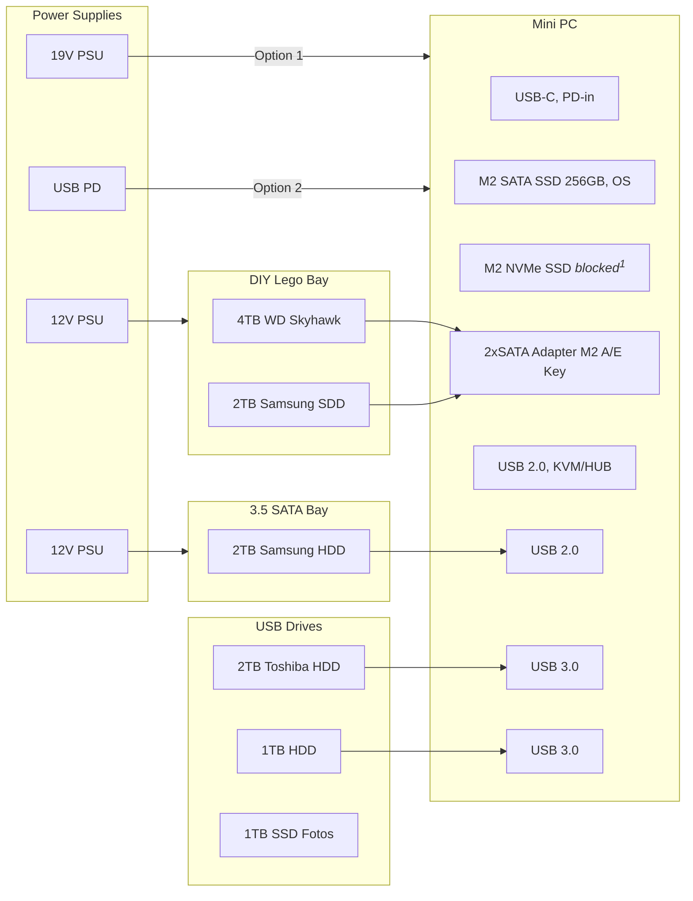
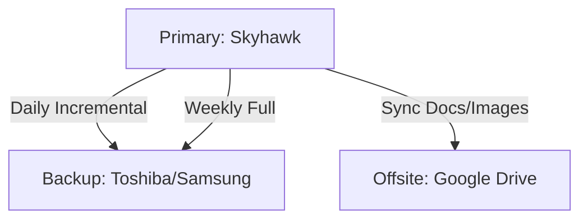

# Homelab Storage and Backup Strategy

## Storage Ports
- Mini PC: 2x SATA (via M.2 A/E), 1x M.2 SATA, 1x NVMe (blocked by SATA adapter),
  2xUSB 2.0, 2xUSB 3.0
- 19V PSU for Mini PC and 5V PSU for RPi4s
- 12V PSU (with 12V barrel to 12/5V SATA power adapter) for SATA drives
- SATA bay for 3.5" drives (with 12V power supply)
- 2x USB to SATA adapters for 2.5" drives (powered via USB)
- 1x USB to SATA case for 2.5" drive (powered via USB)

Mini PC Storage:

<sup>1</sup> NVMe drive blocked by M.2 SATA adapter, can be used if SATA adapter is removed or extended via NVME ribbon cable.

## Power Supply Considerations
- How much power do the 2x12V + 19V PSUs consume when all disks are active?
- Do I need all disks connected all the time?
- Does this setup make sense at all?
- Can a single 12V PSU power all SATA drives? How tom safely split the power?
- 19V vs USB-PD for Mini PC. What is more efficient/reliable?
- USB-PD works fine for Mini PC (idle at 3W) and no issues so far, but blocks USB-C port.
- Can I use the USB-C port for connecting all USB devices?

> [!Note]
> I have many SATA drives. A real drive bay with proper power management would be better eventually.

## Backup Strategy
- Primary storage on Mini PC (4TB WD Skyhawk + 2TB Samsung)
- Local backup on 2TB Toshiba HDD (connected to Mini PC)
- Local backup on 2TB Samsung HDD (connected to Mini PC)
- Offsite backup on 2TB Google Drive (docs + images at lower resolutions)
- Backup frequency:
  - Automated sync of docs/images to Google Drive to make latest files available in the cloud.
    Primary -> Google Drive
  - Daily incremental backups of critical files
    Primary -> Toshiba/Samsung (incremental)
  - Weekly full backups of all files
    Primary -> Toshiba/Samsung (full)

### Backup/Storage Tools
  - MergerFS for pooling multiple disks into a single filesystem
  - SnapRAID for redundancy and data integrity
  - Rclone for syncing files to Google Drive
  - Rsync for local backups and file synchronization
  - BorgBackup for efficient, encrypted backups (if needed)
  - Duplicati for user-friendly backup management (if needed)

### Data Organization
MergerFS pools all disks into a single mount point `/data`. Individual directories are used to separate different types of data. SnapRAID is configured to provide redundancy across the disks.

- Main storage (Skyhawk + Samsung):
  ```
  /data/docs       documents, spreadsheets, etc.
  /data/images     fotos, screenshots, etc.
  /data/media      videos, music, etc.
  /data/docker     Docker volumes, configs, DBs etc. (Home Assistant, PiHole, Immich, etc.)
  /data/services   Non-docker services (e.g. Minecraft server files)
  /data/vms        VM images (if any)
  /data/other      miscellaneous files
  ```

MergerFS configuration: **Existing Path**, **Most Free Space** (epmfs). This policy prioritizes writing new files to a drive that already contains the parent directory of the new file. If the path doesn't exist on any of the drives, it then falls back to the "Most Free Space" policy. This is great for keeping files related to a specific project or folder together on the same drive.

### Low-Power Cold Storage
- Older backups and less frequently accessed data can be moved to older 2.5" SATA HDDs
- The disks should be off most of the time to save power
- HDDs can be connected via USB to SATA adapters

### Backup Flowchart



- Backup storage (Toshiba/Samsung):

- Offsite storage (Google Drive):

